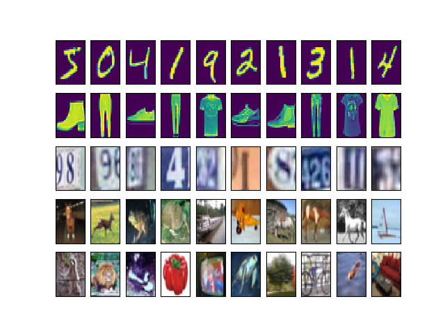

Quickstart
==========

Data Loading
------------

To load any of the pre-coded dataset, use the following

Running the code test_loading.py will generate the following figure

   This is the caption of the figure (a simple paragraph).

Data Pre-Processing
-------------------

The data can be pre-processed prior performing any task.
We provide the following basic pre-processing steps:

- standardize   : scale and center the data

- PCA whitening : use PCA whitening

- ZCA whitening : use ZCA whitening

Running the code test_preprocessing.py will generate the following figure:

Data Augmentation
-----------------

We provide some simple data augmentation tools that can be combined, they are commutative layers:

- random flip

- random crop

- dropout (additive and multiplicative)

